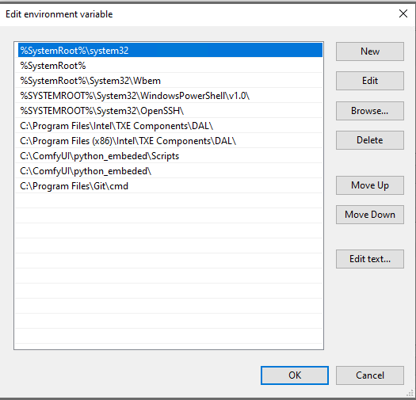
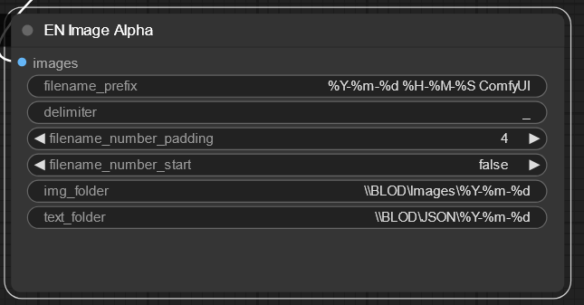
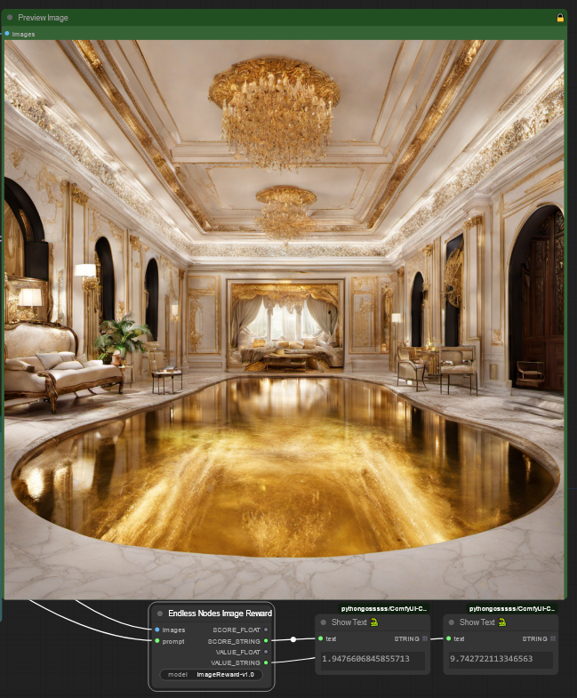
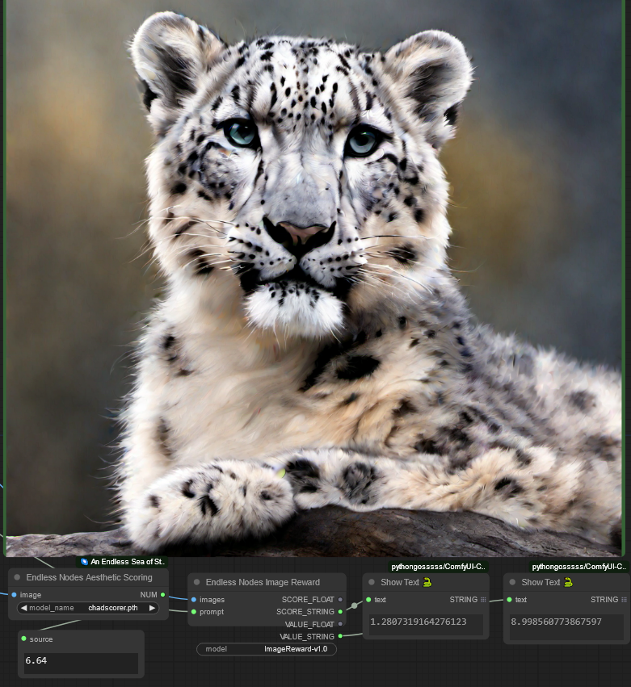
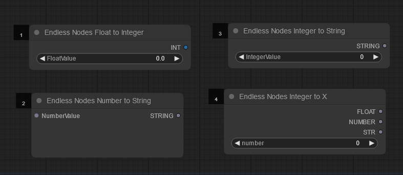

# Endless-Nodes
Some basic custom nodes for the ComfyUI user interface for Stable Diffusion.  Features:

+ An image saver for images and JSON files to base folder, custom folders for one, or custom folders for both.  Also allows for Python timestamping
+ Two aesthetic scoring models, one based on the same as AUTO1111, the other based on Image Reward
+ Converters for various numerical functions to the other (int, float, number) and to strings.  Still in beta
+ Switches for text and numbers
+ Parameter collection nodes
+ MORE TO COME 

When using the [ComfyUI](https://github.com/comfyanonymous/ComfyUI) interface for [Stable Diffusion](https://github.com/Stability-AI/stablediffusion), I sometimes find that the standard nodes and the many, many, many custom nodes out there don't work the way I want them to, or how I think they do.

Rightly or wrongly, I am pretending to teach myself a bit of Python to get some nodes up and running to do what I'd like.  Yes, I am using ChatGPT, and yes I am a glutton for punishment. There are no promises that these nodes will work for you or that I will maintain them.  Feel free to do with them as you wish, according to the license model.

**UPDATE: Oct 14, 2023**

+ ***REINSTATED the Aesthetic Scorers and provided instructions on how to add Clip to your system if you are having issues*** 
+ Added the Global Envoy, which allows you to add height, width, and steps to many modules.  The steps include start, stop and when to cut over to refinement, if you want (either as discrete steps, or a percentage)


**UPDATE: Oct 8, 2023**

+ ***Added a standalone saver node. Fixed bug in this node and main node where image files were overwritten***


**UPDATE: Oct 7, 2023**

+ ***REMOVED THE AESTHETIC SCORERS, TOO MANY PEOPLE CAN'T GET CLIP LOADED.  WILL REVISIT AFTER VACATION***


**UPDATE: Oct 4, 2023**

+ Squished the bugs in the numeric to numeric and string nodes.  Special thanks to [chrisgoringe](https://github.com/chrisgoringe) for some vital insight into correcting messy commas in the tuples for the converter nodes, much appreciated!
+ Added nodes to convert from string to numeric values, with some basic error checking.

**UPDATE: Oct 3, 2023**

+ Added an Image Saver that can place JSON files ***in separate folders***
+ Added nodes to convert from one numeric type to another, and to string.

**UPDATE: Sep 24, 2023**

+ Took the node from https://github.com/ZaneA/ComfyUI-ImageReward that uses Image Reward and repurposed it
+ Took the node from https://github.com/strimmlarn that does aesthetic scoring and repurposed it

**UPDATE: Sep 20, 2023**

+ Added an eight-input number switch because I needed it

**UPDATE: Sep 18, 2023**

+ Added the Endless Nodes Parameterizer with Text_G and Text_L prompt box
+ Added the Parameterizer with a_score for both pos/neg
+ Added the Parameterizer with a_score for both pos/neg and Text_G and Text_L prompt box
+ Fixed some typos


**UPDATE: Sep 17, 2023**

+ Added the Endless Nodes Parameterizer


## Install and Requirements 

Navigate to your /ComfyUI/custom_nodes/ folder 

In Windows, you can then right-click to start a command prompt and type:

`git clone https://github.com/tusharbhutt/Endless-Nodes`

You can also get the nodes via the [ComfyUI Manager](https://github.com/ltdrdata/ComfyUI-Manager)

**NOTE: Requires CLIP and Pytorch-Lightning for the Aesthetic Scorer and ImageReward for my take on the Image Reward node scorer.  Also require colorama for error messages to console. I've added them in the requirement file but if it doesn't work, you will need to download manually**

## IF YOU HAVE ISSUES WITH CLIP....

Some people are reporting having issues with installing Clip from OpenAI, especially if using ComfyUI Manager.  I can tell you in looking at the issues on OpenAI's GitHub, it's not an uncommon complaint.  So, I started from scratch on a new PC that had no software on it other than Windows and tested to see if I could get CLIP installed.  After some minor issues, I was able to get the Python module loaded and working.  If I can do this, I'm sure you can as well, but it will take a bit of effort and you need to have some basic skill in installing software in Windows.  For users of other platforms or if you installed the other Windows version, I'm assuming you have Python and GIT installed already, so the first few instructions will not apply, but the remainder could.

This is what I did:

**TL;DR: Install GIT and Python, ensure the location of Python and Pip are in your PATH, and then use GIT to install Endless-Nodes**

- Installed the Windows standalone version of ComfyUI
- This will install a portable version of Python for you and add the Python folder to your Win
- Downloaded GIT from here: https://git-scm.com/download/win
- **IMPORTANT** This is where having the standalone version may trip you up: both the C:\ComfyUI\python_embeded\Scripts _and_ C:\ComfyUI\python_embeded\ folders need to be in the PATH sectiom of your system variables (_not_ the user variables).  If I recall only the former is added, so you will have to add the second one manually 




- If you do not know how to add environmental variables, [here's a link for you to read](https://www.howtogeek.com/787217/how-to-edit-environment-variables-on-windows-10-or-11/)
- If you do not have both folders added, the program will fail to find Pip and will not correctly install Clip
- Once you have added that PATH, go to the custom folder for Endless Nodes, open up a command prompt (right-click and choose "Command Prompt here") and type the following:

```python -m pip install -r requirements.txt>```

- Note the '-m' and '-r' in the command!  You should see a tonne of programs loading and then a success notice.   Now Endless-Nodes should load properly
- If you did a GIT install of ComfyUI and the ComfyUI Manager fails you, using the command noted above should work for you too, or you may be able to drop the -m part

### What to do if installation fails

You can try to install Clip directly via the following commands(still within the Endless-Nodes folder):

```pip install ftfy regex tqdm
pip install git+https://github.com/openai/CLIP.git```

If **_that_** does not work, then it likely some configuration on your machine is preventing the install.  Ask me **nicely** for a specific module if you're looking for one and I'll see if I can separate it out for you.  Your tone matters, I'm too old to pay attention to people who think I blew up their machines and I will be as short and presumptuous with you as you are with me.  If that bothers you, some self-relfection may be in order.


## Node List

## Endless Image Saver

This is why I tried my hand at Python in the first place!  There are many, many, many, good image saver nodes out there, so why one more? Well:

+ The default saver does not save to UNC in Windows, even if you try to put it in the extra paths YAML file
+ Some savers will allow you to save to UNC but have restricted built-in folder formats
+ You can cobble some savers to save an image together with a text file, but the timestamp on the text file tends to be 2-3 seconds off from the image
+ No saver I know of lets you save the JSON file to a **completely different folder**

So… this node will allow you to save your image file wherever you want, with full support for standard [Python date and time conventions](https://strftime.org/) and you can save the JSON file somewhere else. 

I have more plans for this, but it’s ready for release now.




Does it work... ?


JSONs to the left of me, images to the right of me, and here I am stuck in the middle with you!  It works!

** NOTE: this module is [available separately here](https://github.com/tusharbhutt/Endless-Nodes/blob/main/endless_nodes.py), just toss it in the ComfyUI custom_nodes folder if you don't want the remaining nodes

### A note on timestamp formats

This module uses the standard Python date and time stamp formats, it **_does not_** use the date and time format popular in the WAS Suite.  See below for equivalency examples:

 - WAS Suite would use: ```[time(%Y-%m-%d__%I-%M%p)]```
 - Python stadndard is: ```%Y_%m_%d__%I-%M%p``` 

Note that there is no need to use "\[time(your string here)\]"


## Aesthetic Scorer

This node will output a predicted aesthetic score as a number and display it with the appropriate node (e.g., rgthree's ["Any"](https://github.com/rgthree/rgthree-comfy#display-any) node).  I took the node from https://github.com/strimmlarn that does aesthetic scoring and repurposed it so that it is simpler and outputs the score as a number.  I combined the model loader and score calculator into one, and removed the Aesthetic Score Sorter.  


You can load a number of scoring models, I use the "chadscorer" model found here:

https://github.com/grexzen/SD-Chad/blob/main/chadscorer.pth

As for the original node from strimmlarn, please refer to this GitHub if you would like to examine it:

https://github.com/strimmlarn/ComfyUI-Strimmlarns-Aesthetic-Score

The scorer adds about 7-10 seconds to a workflow on my Nvidia 3060 12 GB card, your mileage may vary

## Image Reward

This node will output a predicted aesthetic score as a number and display it with the appropriate node (e.g., rgthree's ["Any"](https://github.com/rgthree/rgthree-comfy#display-any) node).  I took the node from https://github.com/ZaneA/ComfyUI-ImageReward that in turn scores images using [ImageReward](https://github.com/THUDM/ImageReward).   I combined the model loader and score calculator into one and added output nodes for both the standard deviation calculation (which is what Zane's node does) and the score on a scale of one to ten based on some simple statistic calculations.

The difference between this node and the Aesthetics Scorer is that the underlying ImageReward is based on Reward Feedback Learning (ReFL) and uses 137K input samples that were scored by humans.  It often scores much lower than the Aesthetics Scorer, but not always!



As with the Aesthetics Scorer, the Image Reward node adds about 7-10 seconds to a workflow on my Nvidia 3060 12 GB card, your mileage may vary.  

For added GPU cycle time consumption, put them both in and watch how often they vehemently disagree with the scoring :)




### Endless Node Parameterizer 

This node has a collection of inputs for the CLIP text Encoder and Refiners for SDXL based workflows

Inputs include:

- base width: set width for the base encoder
- base height: set height for the base encoder
- base cropped width: crop width for the base encoder
- base cropped height: crop height for the base encoder
- base target width: target width for the base encoder
- base target height: target height for the base encoder
- refiner width: crop width for the refiner if you have included one
- refiner height: crop height for the refiner if you have included one
- refiner aesthetic score: set the score value for the refiner

You can set up two of these one for the positive and one for the negative prompt


## Parameterizer with prompt

As above, but with TEXT_G and TEXT_L  outputs


## COMBO Parameterizer with and without prompt

After making the Parameterizer, I realized having two separate ones for both the positive and negative CLIP encoders is not optimal, because almost everyone will use the same resolution for both the positive and negative base and refiners.  However, you may (well, you *should…*) want separate aesthetic scorers for the positive and negative CLIPs, so I came up with one that does this for you.  Also comes in a variant that has the prompt boxes for you.


### Six Text Input Switch
Allows the user to select between six text inputs and uses a slider to make the selection.  Useful for multiple inputs for prompt creation


**NOT SHOWN: There is an eight input variant now too, as of Sep 20, 2023**

### Six Integer Input to Six Integer Output
I've seen a fair number of 3-, 4-, or more X-way text input and outputs, I wanted to do something for numbers as well.  Use it as you wish.


### Six Integer Widget
As above, but with widgets for entry instead of connectors


### Various converters

You've seen them elsewhere too, but there are few that do X to float or vice versa, so I threw them in.  *Still in beta*, sometimes they work, other times the downstream node complains.




## Usage License and Restrictions

See GPL Licensing V3 for usage.  You may modify this code as long as you keep the credits for this repository and for those noted in the credit section below.  **YOU ARE EXPRESSLY FORBIDDEN FROM USING THIS NODE TO CREATE ANY IMAGES OR ARTWORK THAT VIOLATES THE STABLE DIFFUSION USAGE NOTES [HERE](https://huggingface.co/stabilityai/stable-diffusion-2#misuse-malicious-use-and-out-of-scope-use) AND [HERE](https://huggingface.co/stabilityai/stable-diffusion-2#misuse-and-malicious-use).**

For example, don't be a mouth-breather who creates fake celebrity nudes or sexual content of **anyone, even if you have their consent**.  JUST. DON’T. BE. A. DICK/BITCH.

The author expressly disclaims any liability for any images you create using these nodes.

## Disclaimer

These nodes may or may not be maintained.  They work on my system but may not on yours.  Feel free to send in a bug report if you find one! 

## Credits

+ [Comfyroll Custom Nodes](https://github.com/RockOfFire/ComfyUI_Comfyroll_CustomNode) for the overall node code layout, coding snippets,  and inspiration for the text input and number switches.

+ [WLSH Nodes](https://github.com/wallish77/wlsh_nodes) for some coding for the Integer Widget.

+ [ComfyUI](https://github.com/comfyanonymous/ComfyUI) Interface for the basic ideas of what nodes I wanted.

+ [ComfyUI-Strimmlarns-Aesthetic-Score](https://github.com/strimmlarn/ComfyUI-Strimmlarns-Aesthetic-Score) for the original coding for the Aesthetic Scorer.  The original scorer, and therefore my derivative too, use the [MLP class code](https://github.com/christophschuhmann/improved-aesthetic-predictor) from Christoph Schuhmann

+ [Zane A's ComfyUI-ImageReward](https://github.com/ZaneA/ComfyUI-ImageReward) for the original coding for the Image Reward node.  Zane's node in turn uses [ImageReward](https://github.com/THUDM/ImageReward)  

+ [Mikey nodes](https://github.com/bash-j/mikey_nodes) to grab code snippet to pass scoring metadata to image

+ Took some base code from the [WAS save image node](https://github.com/WASasquatch/was-node-suite-comfyui) to repurpose it

+ Thanks to [chrisgoringe](https://github.com/chrisgoringe) for some vital insgiht into correcting mesy commas in the tuples for the converter nodes, much appreciated!
#
