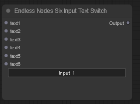
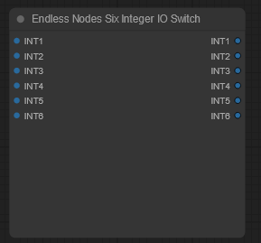
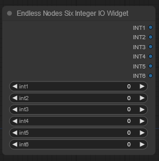
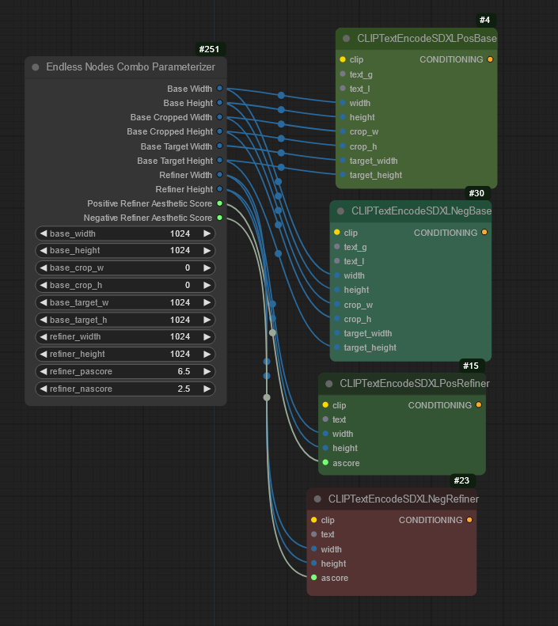
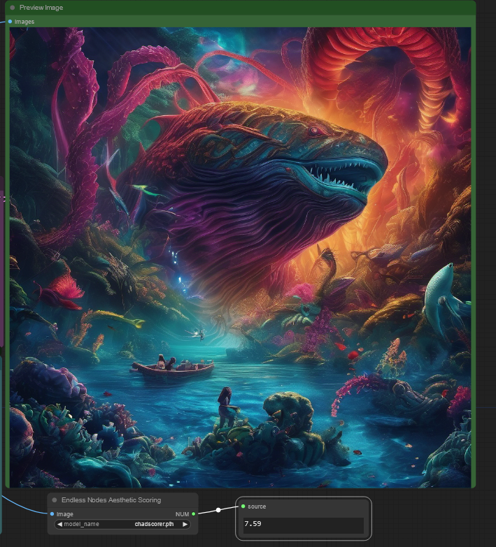

# Endless-Nodes
Some basic custom nodes for the ComfyUI user interface for Stable Diffusion.

When using the [ComfyUI](https://github.com/comfyanonymous/ComfyUI) interface for [Stable Diffusion](https://github.com/Stability-AI/stablediffusion), I sometimes find that the standard nodes and the many, many, many custom nodes out there don't work the way I want them to, or how I think they do.

Rightly or wrongly, I am pretending to teach myself a bit of Python to get some nodes up and running to do what I'd like.  There are no promises that these nodes will work for you or that I will maintain them.  Feel free to do with them as you wish, according to the license model.

**UPDATE: Sep 24, 2023**

+ Took the node from https://github.com/strimmlarn that does aesthetic scoring and repurposed it

**UPDATE: Sep 20, 2023**

+ Added an eight input number switch because I needed it

**UPDATE: Sep 18, 2023**

+ Added the Endless Nodes Parameterizer with Text_G and Text_L prompt box
+ Added the Parameterizer with a_score for both pos/neg
+ Added the Parameterizer with a_score for both pos/neg and Text_G and Text_L prompt box
+ Fixed some typos

**UPDATE: Sep 17, 2023**

+ Added the Endless Nodes Parameterizer

## Install

Navigate to your /ComfyUI/custom_nodes/ folder 

In Windows, you can then right-click to start a command prompt and type:

`git clone https://github.com/tusharbhutt/Endless-Nodes`

You can also get the nodes via the [ComfyUI Manager](https://github.com/ltdrdata/ComfyUI-Manager)

**NOTE: Requires CLIP and Pytorch-Lightning for the Aesthetic Scorer!  I've added them in the requirement file but if it doesn't work, yo will need to download manually**

## Node List

### Six Text Input Switch
Allows the user to select between six text inputs and uses a slider to make the selection.  Useful for multiple inputs for prompt creation

**NOT SHOWN: There is an eight input variant now too, as of Sep 20, 2023**

### Six Integer Input to Six Integer Output
I've seen a fair number of 3-, 4-, or more X-way text input and outputs, I wanted to do something for numbers as well.  Use it as you wish.

### Six Integer Widget
As above, but with widgets for entry instead of connectors

### Endless Node Parameterizer 

This node has a collection of inputs for the CLIP text Encoder and Refiners for SDXL based workflows

Inputs include:

- base width: set width for the base encoder
- base height: set height for the base encoder
- base cropped width: crop width for the base encoder
- base cropped height: crop height for the base encoder
- base target width: target width for the base encoder
- base target height: target height for the base encoder
- refiner width: crop width for the refiner if you have included one
- refiner height: crop height for the refiner if you have included one
- refiner aesthetic score: set the score value for the refiner

You can set up two of these one for the positive and one for the negative prompt

## Parameterizer with prompt

As above, but with TEXT_G and TEXT_L  outputs

## COMBO Parameterizer with and without prompt

After making the Parameterizer, I realized having two separate ones for both the positive and negative CLIP encoders is not optimal, because almost everyone will use the same resolution for both the positive and negative base and refiners.  However, you may (well, you *should…*) want separate aesthetic scorers for the positive and negative CLIPs, so also I came up with one that does this for you.  Also comes in a variant that has the prompt boxes for you.

## Aesthetic Scoring Output ##

This node will output a predicted aestheic score as a number and dispaly it with the appropriate node (e.g., rgthree's "Any" node).  I took the node from https://github.com/strimmlarn that does aesthetic scoring and repurposed it so that it is simpler and outputs the score as a number.  I combined the model loader and score calculator into one, and removed the Aesthetic Score Sorter.  

You can load a number of scoring models, I use the "chadscorer" model found here:

https://github.com/grexzen/SD-Chad/blob/main/chadscorer.pth

As for the original node from strimmlarn,  please refer to this GitHub if you would like to examine it:

https://github.com/strimmlarn/ComfyUI-Strimmlarns-Aesthetic-Score

The scorer adds about 7-10 seconds to a workflow on my Nvidia 3060 12 GB card, your mileage may vary

## Usage License and Restrictions

See GPL Licensing V3 for usage.  You may modify this code as long as you keep the credits for this repository and for those noted in the credit section below.  **YOU ARE EXPRESSLY FORBIDDEN FROM USING THIS NODE TO CREATE ANY IMAGES OR ARTWORK THAT VIOLATES THE STABLE DIFFUSION USAGE NOTES [HERE](https://huggingface.co/stabilityai/stable-diffusion-2#misuse-malicious-use-and-out-of-scope-use) AND [HERE](https://huggingface.co/stabilityai/stable-diffusion-2#misuse-and-malicious-use).**

For example, don't be a mouth-breathing dick who creates fake celebrity nudes or sexual content of **anyone, even** if you have their consent

The author expressly disclaims any liability for any images you create using these nodes.

## Disclaimer

These nodes may or may not be maintained.  They work on my system, but may not on yours.  

## Credits

[Comfyroll Custom Nodes](https://github.com/RockOfFire/ComfyUI_Comfyroll_CustomNode) for the overall node code layout, coding snippets,  and inspiration for the text input and number switches

 [WLSH Nodes](https://github.com/wallish77/wlsh_nodes) for some coding for the Integer Widget

[ComfyUI](https://github.com/comfyanonymous/ComfyUI) Interface for the basic ideas of what nodes I wanted

[ComfyUI-Strimmlarns-Aesthetic-Score](https://github.com/strimmlarn/ComfyUI-Strimmlarns-Aesthetic-Score) for the original coding for Aesthetic Scoring Type One

The orginal scorer, and therefore my derivative too, use the [MLP class code](https://github.com/christophschuhmann/improved-aesthetic-predictor) from Christoph Schuhmann
